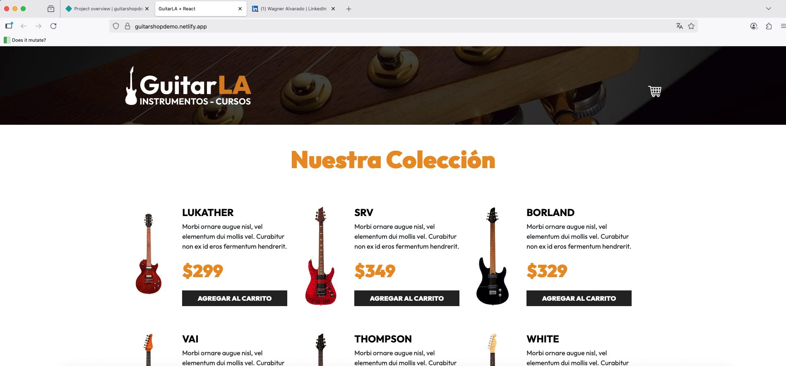

🎸 Guitarla

A web application built with React + Vite that showcases a guitar shop demo project.
This project demonstrates modern front-end development practices including React components, routing, state management, and integration with a Node/Express backend (if required).

🚀 Features

⚡ Fast development with Vite

🎨 Styled with CSS / custom animations

🎸 Reusable React components (e.g., Guitar, Header)

📡 API-ready (integration with Express.js or other backends)

🔄 Build optimized for production

guitarla/
├── public/             # Static assets
├── src/                # React components & logic
│   ├── App.jsx
│   ├── Header.jsx
│   ├── Guitar.jsx
│   ├── db.js
│   └── index.css
├── package.json
├── vite.config.js
└── README.md

🛠️ Installation & Setup

Clone the repository:

git clone https://github.com/capixp/guitarshopdemo.git
cd guitarshopdemo

Install dependencies:

npm install

Run development server:

npm run dev

Build for production:

npm run build

Preview production build:

npm run preview

📷 Screenshots
### Home Page

(Add here project screenshots or GIF demos once deployed)

🚀 Deployment

You can deploy this project easily on:

Vercel

